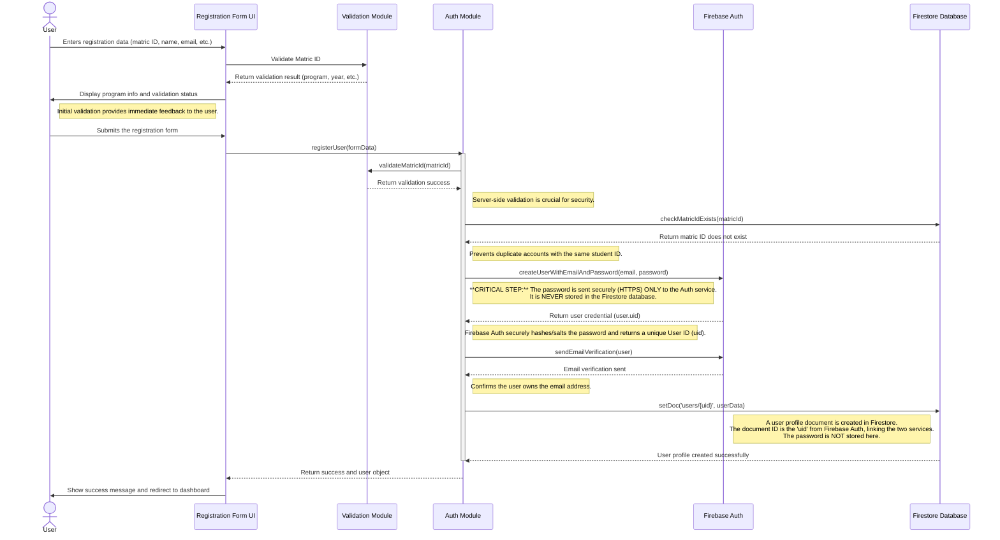

```mermaid
sequenceDiagram
    actor User
    participant RegistrationForm as Registration Form UI
    participant ValidationModule as Validation Module
    participant AuthModule as Auth Module
    participant FirebaseAuth as Firebase Auth
    participant FirestoreDB as Firestore Database

    User->>RegistrationForm: Enters registration data (matric ID, name, email, etc.)
    RegistrationForm->>ValidationModule: Validate Matric ID
    ValidationModule-->>RegistrationForm: Return validation result (program, year, etc.)
    RegistrationForm->>User: Display program info and validation status
    Note right of User: Initial validation provides immediate feedback to the user.

    User->>RegistrationForm: Submits the registration form
    RegistrationForm->>AuthModule: registerUser(formData)
    activate AuthModule

    AuthModule->>ValidationModule: validateMatricId(matricId)
    ValidationModule-->>AuthModule: Return validation success
    Note right of AuthModule: Server-side validation is crucial for security.

    AuthModule->>FirestoreDB: checkMatricIdExists(matricId)
    FirestoreDB-->>AuthModule: Return matric ID does not exist
    Note right of AuthModule: Prevents duplicate accounts with the same student ID.

    AuthModule->>FirebaseAuth: createUserWithEmailAndPassword(email, password)
    Note left of FirebaseAuth: **CRITICAL STEP:** The password is sent securely (HTTPS) ONLY to the Auth service. <br/> It is NEVER stored in the Firestore database.
    FirebaseAuth-->>AuthModule: Return user credential (user.uid)
    Note right of AuthModule: Firebase Auth securely hashes/salts the password and returns a unique User ID (uid).

    AuthModule->>FirebaseAuth: sendEmailVerification(user)
    FirebaseAuth-->>AuthModule: Email verification sent
    Note right of AuthModule: Confirms the user owns the email address.

    AuthModule->>FirestoreDB: setDoc('users/{uid}', userData)
    Note left of FirestoreDB: A user profile document is created in Firestore. <br/> The document ID is the 'uid' from Firebase Auth, linking the two services. <br/> The password is NOT stored here.
    FirestoreDB-->>AuthModule: User profile created successfully

    deactivate AuthModule
    AuthModule-->>RegistrationForm: Return success and user object
    RegistrationForm->>User: Show success message and redirect to dashboard
```
