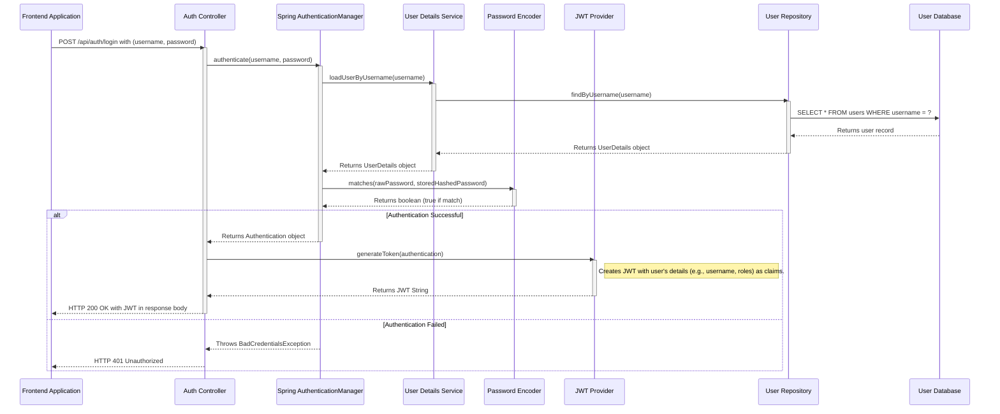

```mermaid
sequenceDiagram
    participant Client as Frontend Application
    participant AuthController as Auth Controller
    participant AuthManager as Spring AuthenticationManager
    participant UserDetailsService as User Details Service
    participant PasswordEncoder as Password Encoder
    participant JwtProvider as JWT Provider
    participant UserRepository as User Repository
    participant Database as User Database

    Client->>AuthController: POST /api/auth/login with (username, password)
    activate AuthController

    AuthController->>AuthManager: authenticate(username, password)
    activate AuthManager

    AuthManager->>UserDetailsService: loadUserByUsername(username)
    activate UserDetailsService
    UserDetailsService->>UserRepository: findByUsername(username)
    activate UserRepository
    UserRepository->>Database: SELECT * FROM users WHERE username = ?
    Database-->>UserRepository: Returns user record
    UserRepository-->>UserDetailsService: Returns UserDetails object
    deactivate UserRepository
    UserDetailsService-->>AuthManager: Returns UserDetails object
    deactivate UserDetailsService

    AuthManager->>PasswordEncoder: matches(rawPassword, storedHashedPassword)
    activate PasswordEncoder
    PasswordEncoder-->>AuthManager: Returns boolean (true if match)
    deactivate PasswordEncoder

    alt Authentication Successful
        AuthManager-->>AuthController: Returns Authentication object
        deactivate AuthManager

        AuthController->>JwtProvider: generateToken(authentication)
        activate JwtProvider
        Note right of JwtProvider: Creates JWT with user's details (e.g., username, roles) as claims.
        JwtProvider-->>AuthController: Returns JWT String
        deactivate JwtProvider

        AuthController-->>Client: HTTP 200 OK with JWT in response body
        deactivate AuthController
    else Authentication Failed
        AuthManager-->>AuthController: Throws BadCredentialsException
        AuthController-->>Client: HTTP 401 Unauthorized
    end
```
