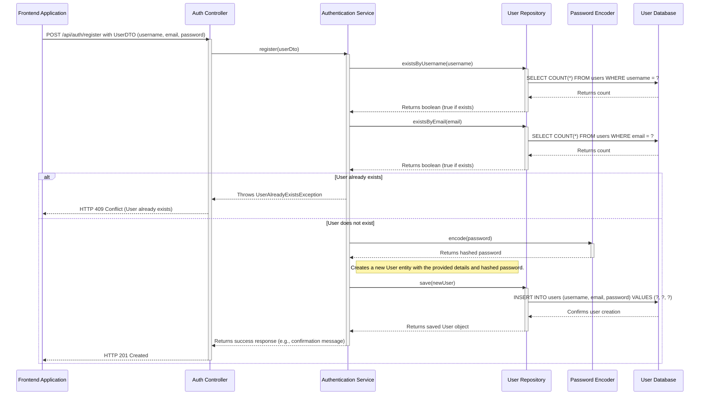

```mermaid
sequenceDiagram
    participant Client as Frontend Application
    participant AuthController as Auth Controller
    participant AuthService as Authentication Service
    participant UserRepository as User Repository
    participant PasswordEncoder as Password Encoder
    participant Database as User Database

    Client->>AuthController: POST /api/auth/register with UserDTO (username, email, password)
    activate AuthController

    AuthController->>AuthService: register(userDto)
    activate AuthService

    AuthService->>UserRepository: existsByUsername(username)
    activate UserRepository
    UserRepository->>Database: SELECT COUNT(*) FROM users WHERE username = ?
    Database-->>UserRepository: Returns count
    UserRepository-->>AuthService: Returns boolean (true if exists)
    deactivate UserRepository

    AuthService->>UserRepository: existsByEmail(email)
    activate UserRepository
    UserRepository->>Database: SELECT COUNT(*) FROM users WHERE email = ?
    Database-->>UserRepository: Returns count
    UserRepository-->>AuthService: Returns boolean (true if exists)
    deactivate UserRepository

    alt User already exists
        AuthService-->>AuthController: Throws UserAlreadyExistsException
        AuthController-->>Client: HTTP 409 Conflict (User already exists)
    else User does not exist
        AuthService->>PasswordEncoder: encode(password)
        activate PasswordEncoder
        PasswordEncoder-->>AuthService: Returns hashed password
        deactivate PasswordEncoder

        Note right of AuthService: Creates a new User entity with the provided details and hashed password.

        AuthService->>UserRepository: save(newUser)
        activate UserRepository
        UserRepository->>Database: INSERT INTO users (username, email, password) VALUES (?, ?, ?)
        Database-->>UserRepository: Confirms user creation
        UserRepository-->>AuthService: Returns saved User object
        deactivate UserRepository

        AuthService-->>AuthController: Returns success response (e.g., confirmation message)
        deactivate AuthService

        AuthController-->>Client: HTTP 201 Created
        deactivate AuthController
    end
```
